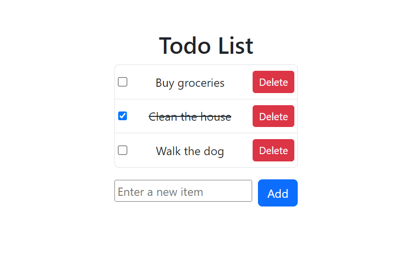

# Todo List

This repository contains a simple Todo List application implemented using React.

The Todo List allows you to keep track of tasks or items that need to be completed. You can add new tasks, mark tasks as completed, and remove tasks from the list.

## Screenshots

Here are some screenshots of the web in action:

<div style="display: flex; justify-content: center;">
  
</div>

## Features

- Add new tasks to the list.
- Mark tasks as completed.
- Remove tasks from the list.

## Getting Started

To get started with the Todo List, follow these steps:

1. Clone the repository:

```shell
  git clone https://github.com/your-username/todo-list.git
```
2. Install the dependencies:

```shell
  cd todo-list
```
```shell
  npm install
```

3. Start the development server:
```shell
  npm run dev
```
